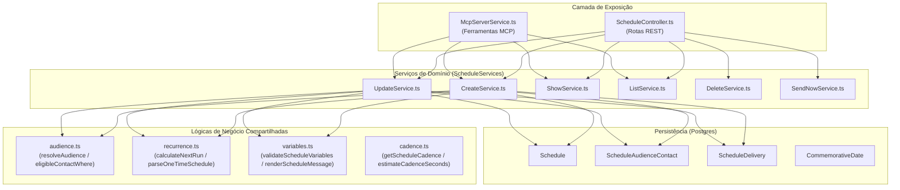

# Plano Técnico: Expansão da Integração MCP para Criação de Agendamentos no Espaço Whats (Ticketz)

**Data:** 20/08/2026  
**Status:** Proposta Técnica / Planejamento  
**Autor:** Agente PLANO  
**Destinatário:** LIDER  
**Repositório:** `ticketz` (Branch: `main`)  
**Arquivo de Entrega:** `docs/plans/2026-08-20-mcp-agendamentos-plano.md`

---

## Resolução Prévia: Questão nº 1 (Achado Material do Domínio)

### Declaração Explícita da Conclusão
A leitura correta do domínio e da demanda é categoricamente a **(A)**:
> **"Agendamento" refere-se exclusivamente ao domínio `Schedule` já existente no repositório (Agendamento de Mensagens / Disparos de WhatsApp programados: Data Única, Aniversário e Datas Comemorativas).**

A hipótese **(B)** ("consulta clínica com paciente, médico/profissional, agenda de consultório, horários vagos e conflito de agenda") **NÃO existe no sistema Ticketz/Espaço Whats**. O exemplo "Agende uma consulta para o paciente X amanhã às 15h" formulado na solicitação trata-se de um exemplo de linguagem natural de usuário final usando o sistema para **disparo de mensagem de lembrete de consulta** para um contato via WhatsApp, e não de um sistema hospitalar/médico de prontuário e booking de salas/profissionais.

### Evidências Técnicas Levantadas na Codebase e Produção

1. **Modelos de Banco de Dados (`backend/src/models/`):**
   - Foram auditados todos os 57 modelos Sequelize do repositório.
   - O único modelo relativo a agendamentos é [`Schedule.ts`](file:///Users/guizeroum/projetos/ticketz/backend/src/models/Schedule.ts) (apoiado por [`ScheduleAudienceContact.ts`](file:///Users/guizeroum/projetos/ticketz/backend/src/models/ScheduleAudienceContact.ts), [`ScheduleDelivery.ts`](file:///Users/guizeroum/projetos/ticketz/backend/src/models/ScheduleDelivery.ts) e [`CommemorativeDate.ts`](file:///Users/guizeroum/projetos/ticketz/backend/src/models/CommemorativeDate.ts)).
   - Não existe tabela, coluna ou relacionamento para `Doctor`, `Professional`, `Patient`, `Appointment`, `Slot`, `Room` ou `Specialty`.

2. **Rotas e Telas do Frontend (`frontend/src/`):**
   - No menu lateral ([`MainListItems.js`](file:///Users/guizeroum/projetos/ticketz/frontend/src/layout/MainListItems.js#L290-L293)) e nas rotas ([`routes/index.js`](file:///Users/guizeroum/projetos/ticketz/frontend/src/routes/index.js#L86-L90)), a rota `/schedules` aponta para [`pages/Schedules/index.js`](file:///Users/guizeroum/projetos/ticketz/frontend/src/pages/Schedules/index.js), cuja UI possui as abas **Agendamentos** e **Datas comemorativas**.
   - O modal de cadastro ([`components/ScheduleModal/index.js`](file:///Users/guizeroum/projetos/ticketz/frontend/src/components/ScheduleModal/index.js)) manipula tipo de envio (`Data única`, `Aniversário`, `Data comemorativa`), seleção de contatos WhatsApp (`Todos` ou `Selecionados`), data/hora, fuso horário, variáveis Mustache (`{{nome}}`, `{{apelido}}`, etc.) e anexo de mídia.
   - O arquivo de tradução do módulo de agendamento ([`translate/languages/scheduling.js`](file:///Users/guizeroum/projetos/ticketz/frontend/src/translate/languages/scheduling.js)) comprova que todas as mensagens e erros referem-se a disparos de mensagens e campanhas pontuais/recorrentes.

3. **Arquitetura MCP Atual:**
   - A ferramenta de leitura [`list_schedules`](file:///Users/guizeroum/projetos/ticketz/backend/src/services/McpServices/McpServerService.ts#L253-L268) já existe e está em produção listando registros da tabela `Schedules`.
   - O documento oficial de implantação ([`docs/chatgpt-mcp-deployment.md`](file:///Users/guizeroum/projetos/ticketz/docs/chatgpt-mcp-deployment.md#L80)) documenta `list_schedules` como: *"Agendamentos únicos, de aniversário e de data comemorativa, com público, próxima ocorrência, modelo de mensagem e contadores de entrega"*.

**Conclusão Operacional:** A premissa de **reutilizar 100% da lógica de agendamento existente** (`ScheduleServices/{CreateService, UpdateService, ShowService, ListService, audience, recurrence, variables, cadence}`) é plenamente válida, sólida e exequível dentro do escopo de escrita MCP.

---

## 1. Funcionamento Atual

Atualmente, a gestão de agendamentos no Espaço Whats funciona da seguinte maneira:
- **Interface Web:** Usuários autenticados acessam a tela `/schedules`. Nela, podem visualizar agendamentos existentes, filtrar por status/tipo/período, criar novos agendamentos via `ScheduleModal`, editar, excluir ou disparar imediatamente via ação `sendNow`.
- **Criação de Agendamento:** O usuário define:
  1. *Público (`audienceMode`):* `ALL` (todos os contatos elegíveis da empresa) ou `SELECTED` (um ou mais contatos específicos).
  2. *Tipo (`kind`):* `ONCE` (disparo único em data/hora específica), `BIRTHDAY` (anual no aniversário do contato em determinado horário), ou `COMMEMORATIVE` (anual vinculado a uma `CommemorativeDate` ativa da empresa).
  3. *Quando:* Data/hora de envio (`sendAt` ou `sendTime`), respeitando o fuso horário configurado (`timezone`).
  4. *Mensagem:* Texto do template contendo variáveis dinâmicas Mustache (`{{nome}}`, `{{primeiro_nome}}`, `{{apelido}}`, `{{saudacao}}`, `{{extra.<campo>}}`, etc.).
  5. *Mídia (opcional):* Upload de imagem, GIF ou vídeo com modo de entrega `CAPTION` ou `SEPARATE`.
- **Motor de Disparo em Segundo Plano:** O serviço Bull Queue [`ScheduleMonitor`](file:///Users/guizeroum/projetos/ticketz/backend/src/queues.ts#L109-L280) executa periodicamente:
  - Identifica agendamentos ativos onde `nextRunAt <= NOW()`.
  - Resolve a audiência elegível (validando números de WhatsApp e aniversários do dia).
  - Cria os registros em `ScheduleDelivery`.
  - Enfileira na fila `SendScheduledMessages` respeitando a cadência anti-bloqueio configurada em `CampaignSettings` (`messageInterval`, `longerIntervalAfter`, `greaterInterval`).

---

## 2. Arquitetura Atual do MCP

A integração MCP (Model Context Protocol) do Espaço Whats é implementada no backend com as seguintes características:

- **Protocolo & Transporte:** Servidor HTTP Streamable via `@modelcontextprotocol/sdk` (`McpServer` + `StreamableHTTPServerTransport` em [`McpServerService.ts`](file:///Users/guizeroum/projetos/ticketz/backend/src/services/McpServices/McpServerService.ts)).
- **Autenticação & Autorização OAuth 2.0 / RFC 9068 / RFC 8414:**
  - Descoberta OAuth em `/.well-known/oauth-authorization-server` e `/.well-known/oauth-protected-resource`.
  - Fluxo de autorização com consentimento explícito do usuário administrador.
  - JWTs assinados com chave privada RSA (2048/3072 bits) configurada em `MCP_PRIVATE_KEY` / `MCP_PUBLIC_KEY`.
  - Contexto de autenticação imutável [`McpAuthContext`](file:///Users/guizeroum/projetos/ticketz/backend/src/services/McpServices/OAuthService.ts#L61-L68): `{ grantId, userId, companyId, clientId, scopes, expiresAt }`.
- **Fonte Única da Verdade para Escopos:** `TOOL_SCOPES` em [`McpServerService.ts`](file:///Users/guizeroum/projetos/ticketz/backend/src/services/McpServices/McpServerService.ts#L33-L45) mapeia cada ferramenta ao seu escopo obrigatório.
- **Escopos Declarados em [`mcpConfig.scopes`](file:///Users/guizeroum/projetos/ticketz/backend/src/config/mcp.ts#L43-L48):**
  - `conversations:read`
  - `reports:read`
  - `quick_messages:read`
  - `quick_messages:write`
- **Ferramentas Atuais:**
  - *Leitura:* `get_espaco_whats_context`, `get_conversation_stats`, `get_attendant_metrics`, `list_conversations`, `list_contacts`, `list_schedules`, `read_conversations`, `read_conversation`, `list_quick_messages`.
  - *Escrita:* `create_quick_message`, `update_quick_message` (isoladas no serviço canônico [`McpQuickMessageService.ts`](file:///Users/guizeroum/projetos/ticketz/backend/src/services/McpServices/McpQuickMessageService.ts)).
- **Anotações de Ferramenta (Hints para IA):**
  - `readOnlyAnnotations`: `{ readOnlyHint: true, destructiveHint: false, openWorldHint: false }`.
  - `writeAnnotations`: `{ readOnlyHint: false, destructiveHint: false, idempotentHint: false, openWorldHint: false }`. O `idempotentHint: false` força o ChatGPT a solicitar confirmação explícita do usuário antes da execução.
- **Auditoria & Privacidade:**
  - Modelo [`McpAudit.ts`](file:///Users/guizeroum/projetos/ticketz/backend/src/models/McpAudit.ts).
  - Sanitização de filtros via `sanitizeFilters()` para nunca persistir textos livres, mensagens, contatos ou segredos nos logs de auditoria.

---

## 3. Arquitetura Atual de Agendamentos

A camada de negócios de agendamentos está localizada em `backend/src/services/ScheduleServices/`:



- **[`CreateService.ts`](file:///Users/guizeroum/projetos/ticketz/backend/src/services/ScheduleServices/CreateService.ts):**
  - Valida tamanho mínimo da mensagem (mínimo 5 caracteres).
  - Valida variáveis Mustache contra a lista oficial e campos personalizados do tenant ([`variables.ts`](file:///Users/guizeroum/projetos/ticketz/backend/src/services/ScheduleServices/variables.ts)).
  - Resolve a audiência ([`audience.ts`](file:///Users/guizeroum/projetos/ticketz/backend/src/services/ScheduleServices/audience.ts)) filtrando contatos válidos de WhatsApp (`channel === 'whatsapp'`, `isGroup === false`, telefone com 8-20 dígitos numéricos).
  - Calcula a próxima execução [`nextRunAt`](file:///Users/guizeroum/projetos/ticketz/backend/src/services/ScheduleServices/recurrence.ts) com base no fuso IANA e regras de recorrência.
  - Cria atomicamente (`sequelize.transaction`) o `Schedule`, os `ScheduleAudienceContact` (se `SELECTED`) e os `ScheduleDelivery` (se `ONCE`).
- **[`UpdateService.ts`](file:///Users/guizeroum/projetos/ticketz/backend/src/services/ScheduleServices/UpdateService.ts):**
  - Valida se o agendamento já foi iniciado (`ScheduleDelivery.count({ status: ['QUEUED', 'SENT'] }) > 0` impede edição de `ONCE` já disparado).
  - Recalcula audiência e próxima execução, atualizando entregas pendentes.

---

## 4. Problemas e Limitações Encontradas

1. **MCP Limitado a Leitura de Agendamentos:** O MCP atual expõe apenas `list_schedules` sob o escopo `conversations:read`. O ChatGPT não possui nenhuma ferramenta para criar, simular ou alterar agendamentos.
2. **Capacidade Declarada Desatualizada no Contexto:** Em [`McpDataService.ts`](file:///Users/guizeroum/projetos/ticketz/backend/src/services/McpServices/McpDataService.ts#L299), `getTicketzContext` retorna `capabilities.scheduleWrites: false`.
3. **Ausência de Escopo Específico de Escrita:** Não existe o escopo `schedules:write` em `mcpConfig.scopes` nem em `TOOL_SCOPES`.
4. **Sanitização de Auditoria Incompleta para Agendamentos:** A função `sanitizeFilters` em `McpServerService.ts` sanitiza apenas `["contact", "search", "cursor", "message"]`. O campo `body` (texto do agendamento) não está na lista de exclusão da auditoria, o que violaria o princípio de privacidade se registrado diretamente.
5. **Risco de Ambiguidade no Fuso Horário:** Clientes LLM podem enviar datas sem offset ou com fusos incorretos. A API precisa garantir fallback determinístico para o fuso do tenant configurado em `Company.schedules.timezone` ou `mcpConfig.timezone`.
6. **Contatos Selecionados em Massa:** Se o ChatGPT tentar criar um agendamento com centenas de IDs de contatos em um único payload JSON, pode sobrecarregar a requisição. É necessário estabelecer um limite máximo seguro por chamada (ex.: máximo 100 contatos explícitos no modo `SELECTED`).

---

## 5. Novas Ferramentas MCP Necessárias

Para garantir o **mínimo coerente**, alta segurança e evitar alucinações, propõe-se um conjunto conciso e estritamente justificado de ferramentas:

### Ferramentas Propostas

| Ferramenta | Escopo | Anotações | Descrição & Justificativa |
|---|---|---|---|
| **`create_schedule`** | `schedules:write` | `writeAnnotations` (`idempotentHint: false`) | **Criação de agendamento.** Cria agendamento de mensagem (`ONCE`, `BIRTHDAY` ou `COMMEMORATIVE`) em nome do tenant. Reutiliza integralmente `CreateService`. O `idempotentHint: false` obriga o ChatGPT a pedir confirmação ao usuário antes de salvar. |
| **`preview_schedule`** | `schedules:write` | `readOnlyAnnotations` | **Simulação/Validação prévia (Dry-run).** Permite ao ChatGPT validar se as variáveis Mustache estão corretas, calcular quantos contatos serão impactados, verificar se há contatos com dados faltantes (ex.: sem apelido ou sem aniversário) e obter a data/hora exata da próxima execução calculada antes de chamar `create_schedule`. |
| **`update_schedule`** | `schedules:write` | `writeAnnotations` (`idempotentHint: false`) | **Edição de agendamento existente.** Permite alterar texto, data/hora, status ativo (`active: true/false` para pausar/retomar) ou audiência de um agendamento não iniciado. Reutiliza integralmente `UpdateService`. |

### Ferramentas Analisadas e Descartadas (com Justificativa Técnica)

1. **`delete_schedule` (Exclusão física):**
   - *Status:* **DESCARTADA.**
   - *Justificativa:* Segue o padrão canônico adotado em `McpQuickMessageService` e na política de segurança do produto: ações destrutivas irreversíveis (DELETE em cascata com destruição de mídias e logs de entrega) não devem ser delegadas a chamadas autônomas de LLM. Para interromper um agendamento, o modelo utiliza `update_schedule` com `active: false`. A exclusão física definitiva permanece restrita à ação humana na UI.
2. **`send_now_schedule` (Disparo imediato antecipado):**
   - *Status:* **DESCARTADA no MVP.**
   - *Justificativa:* O disparo imediato (`SendNowService`) ignora o timer agendado e coloca imediatamente mensagens na fila de envio de WhatsApp. Executar isso via assistente conversacional apresenta alto risco de disparos acidentais em massa sem revisão, com risco de banimento de número no WhatsApp.
3. **`find_contact` / `search_patient` (Localização de contato/paciente):**
   - *Status:* **DESCARTADA (Redundante).**
   - *Justificativa:* A ferramenta `list_contacts` já existe sob `conversations:read` com busca flexível por nome, apelido, telefone, e-mail, tags e aniversários. Não é necessária ferramenta adicional.
4. **`check_doctor_availability` / `book_consultation_slot`:**
   - *Status:* **DESCARTADA (Domínio Inexistente).**
   - *Justificativa:* Conforme evidenciado na Questão nº 1, o sistema não possui domínio médico/agenda clínica.

---

## 6. Novos Scopes / Permissões

Seguindo o padrão arquitetural `<recurso>:<ação>` já adotado no projeto:

- **`schedules:write`** (Novo): Concede autorização para simular (`preview_schedule`), criar (`create_schedule`) e alterar (`update_schedule`) agendamentos de mensagens.
- **`conversations:read`** (Existente): Continua autorizando a leitura de agendamentos (`list_schedules`), garantindo **retrocompatibilidade total** para integrações já existentes que utilizam apenas leitura.

### Matriz de Ferramentas e Escopos Atualizada

| Ferramenta | Escopo Exigido | Tipo de Operação |
|---|---|---|
| `get_espaco_whats_context` | `conversations:read` | Leitura (Contexto do Tenant) |
| `list_conversations` | `conversations:read` | Leitura (Conversas) |
| `list_contacts` | `conversations:read` | Leitura (Contatos) |
| `list_schedules` | `conversations:read` | Leitura (Agendamentos) |
| `read_conversations` / `read_conversation` | `conversations:read` | Leitura (Mensagens) |
| `get_conversation_stats` | `reports:read` | Leitura (Métricas) |
| `get_attendant_metrics` | `reports:read` | Leitura (Métricas de Atendentes) |
| `list_quick_messages` | `quick_messages:read` | Leitura (Respostas Rápidas) |
| `create_quick_message` | `quick_messages:write` | Escrita (Respostas Rápidas) |
| `update_quick_message` | `quick_messages:write` | Escrita (Respostas Rápidas) |
| `preview_schedule` *(Nova)* | `schedules:write` | Leitura / Simulação (Agendamentos) |
| `create_schedule` *(Nova)* | `schedules:write` | Escrita (Agendamentos) |
| `update_schedule` *(Nova)* | `schedules:write` | Escrita (Agendamentos) |

---

## 7. Arquivos que Precisarão ser Alterados / Criados

### Arquivos Existentes a Modificar
1. [`backend/src/config/mcp.ts`](file:///Users/guizeroum/projetos/ticketz/backend/src/config/mcp.ts): Inclusão de `"schedules:write"` no array `scopes`.
2. [`backend/src/services/McpServices/McpServerService.ts`](file:///Users/guizeroum/projetos/ticketz/backend/src/services/McpServices/McpServerService.ts):
   - Mapeamento das 3 novas ferramentas em `TOOL_SCOPES`.
   - Adição de `body` na sanitização de filtros em `sanitizeFilters()`.
   - Registro das ferramentas `preview_schedule`, `create_schedule` e `update_schedule` em `createServer()`.
   - Atualização das `instructions` do `McpServer`.
3. [`backend/src/services/McpServices/McpDataService.ts`](file:///Users/guizeroum/projetos/ticketz/backend/src/services/McpServices/McpDataService.ts):
   - Atualização de `capabilities.scheduleWrites: true` em `getTicketzContext()`.
   - Inclusão dos limites de agendamento em `limits` (ex.: `scheduleBodyMaxLength`, `maxScheduleContacts`).
4. [`docs/chatgpt-mcp-deployment.md`](file:///Users/guizeroum/projetos/ticketz/docs/chatgpt-mcp-deployment.md): Atualização da documentação operacional, tabela de dados expostos e instruções de reconexão do conector OAuth.

### Novos Arquivos a Criar
1. `backend/src/services/McpServices/McpScheduleService.ts`: Serviço canônico de escrita e validação de agendamentos para MCP (espelhando `McpQuickMessageService.ts`).
2. `backend/src/__tests__/services/McpScheduleService.spec.ts`: Suíte de testes unitários e de integração mockada cobrindo todas as regras, isolamento por tenant, validações e casos de erro.

---

## 8. Alterações de Backend

### 8.1. Criação de `McpScheduleService.ts`
Implementará as seguintes constantes, tipos e funções:

```typescript
export const SCHEDULE_LIMITS = {
  bodyMinLength: 5,
  bodyMaxLength: 5000,
  maxSelectedContacts: 100
};

export type ScheduleView = {
  id: number;
  kind: "ONCE" | "BIRTHDAY" | "COMMEMORATIVE";
  status: string;
  active: boolean;
  audienceMode: "ALL" | "SELECTED";
  body: string;
  sendAt: string | null;
  sendTime: string | null;
  timezone: string;
  nextRunAt: string | null;
  totalRecipients: number;
  commemorativeDate?: { id: number; name: string } | null;
  contacts?: Array<{ id: number; name: string; number: string }>;
  createdAt: Date;
  updatedAt: Date;
};
```

- **`previewSchedule(auth: McpAuthContext, input: ScheduleInput)`**:
  - Resolve fuso horário via `getTimezone(auth.companyId)`.
  - Normaliza payload e valida variáveis Mustache contra `customFieldNames(auth.companyId)`.
  - Executa `resolveAudience` e `calculateNextRun`.
  - Retorna resumo com: `eligibleCount`, `excludedCount`, `missingVariables`, `estimatedDurationSeconds`, `nextRunAt` e `sampleRenderedMessage`.
- **`createSchedule(auth: McpAuthContext, input: ScheduleInput)`**:
  - Valida inputs (tamanho do body, kind, fuso horário, IDs de contato).
  - Executa [`ScheduleServices/CreateService`](file:///Users/guizeroum/projetos/ticketz/backend/src/services/ScheduleServices/CreateService.ts) passando `companyId: auth.companyId` e `userId: auth.userId`.
  - Dispara evento WebSocket: `getIO().to("company-" + auth.companyId + "-mainchannel").emit("company-" + auth.companyId + "-schedule", { action: "create", schedule })` (protegido por `try/catch` para não falhar a escrita caso o socket oscile).
  - Retorna o `ScheduleView` formatado.
- **`updateSchedule(auth: McpAuthContext, input: UpdateScheduleInput)`**:
  - Verifica a existência e posse do registro pelo tenant via [`ScheduleServices/ShowService`](file:///Users/guizeroum/projetos/ticketz/backend/src/services/ScheduleServices/ShowService.ts).
  - Executa [`ScheduleServices/UpdateService`](file:///Users/guizeroum/projetos/ticketz/backend/src/services/ScheduleServices/UpdateService.ts).
  - Emite evento WebSocket com `action: "update"`.
  - Retorna o `ScheduleView` atualizado.

### 8.2. Atualização de `McpServerService.ts`
- Registro dos esquemas Zod estritos para cada ferramenta.
- Configuração de `writeAnnotations` para `create_schedule` e `update_schedule`.
- Configuração de `readOnlyAnnotations` para `preview_schedule`.
- Inclusão de `body` no filtro de exclusão de `sanitizeFilters(input)` para que textos de agendamento não sejam armazenados no log de auditoria `McpAudit`.

---

## 9. Alterações de Frontend e Configuração da Integração

- **Frontend Ticketz:** Não requer modificação de código React no MVP. As telas existentes (`/schedules` e `/chatgpt`) já escutam eventos de WebSocket (`company-${companyId}-schedule`), o que significa que agendamentos criados ou atualizados pelo ChatGPT aparecerão **em tempo real** na tela do operador.
- **Configuração no ChatGPT:**
  - Devido ao modelo de segurança OAuth 2.0, novos escopos (`schedules:write`) não são concedidos automaticamente a tokens já emitidos.
  - Usuários que já possuem o conector ChatGPT configurado precisarão realizar a **reautorização do conector** em **ChatGPT → Configurações → Conectores / Apps Conectados → Espaço Whats** (refazendo o login e consentindo com as novas permissões de agendamento).

---

## 10. Regras de Validação

1. **Mensagem (`body`):**
   - Obrigatório, tipo string.
   - Tamanho mínimo: 5 caracteres (`ERR_SCHEDULE_INVALID_MESSAGE`).
   - Tamanho máximo: 5.000 caracteres.
   - Variáveis Mustache: Devem pertencer obrigatoriamente à lista `BUILT_IN_SCHEDULE_VARIABLES` ou à lista de campos customizados do tenant no formato `{{extra.<nome_normalizado>}}` (`ERR_SCHEDULE_UNKNOWN_VARIABLE`).
2. **Tipo de Agendamento (`kind`):**
   - Valores permitidos: `"ONCE"`, `"BIRTHDAY"`, `"COMMEMORATIVE"`.
3. **Modo de Audiência (`audienceMode`):**
   - `"ALL"`: Válido apenas se existirem contatos WhatsApp elegíveis no tenant.
   - `"SELECTED"`: Requer array `contact_ids` não vazio.
4. **Destinatários (`contact_ids`):**
   - Array de inteiros positivos.
   - Mínimo de 1 e máximo de 100 contatos por chamada no MCP.
   - Todos os contatos devem pertencer ao tenant (`companyId`), possuir canal WhatsApp (`channel === 'whatsapp'`), não ser grupos (`isGroup === false`) e ter número de telefone válido. Caso algum ID seja inválido ou de outro tenant, a operação é rejeitada (`ERR_SCHEDULE_INVALID_RECIPIENT`).
5. **Data e Hora:**
   - Para `kind === "ONCE"`: `send_at` é obrigatório, formato ISO 8601 (ex.: `2026-08-21T15:00:00-05:00` ou `2026-08-21T15:00:00Z`). A data calculada não pode estar no passado.
   - Para `kind === "BIRTHDAY"` ou `"COMMEMORATIVE"`: `send_time` é obrigatório no formato `HH:mm` (24h, entre `00:00` e `23:59`).
6. **Data Comemorativa (`commemorative_date_id`):**
   - Obrigatório se `kind === "COMMEMORATIVE"`.
   - Deve referenciar uma `CommemorativeDate` existente, ativa e pertencente ao tenant autenticado (`companyId`). Caso contrário, retorna `ERR_COMMEMORATIVE_DATE_NOT_FOUND`.
7. **Fuso Horário (`timezone`):**
   - String IANA válida (ex.: `America/Sao_Paulo`, `America/Rio_Branco`, `UTC`).
   - Se omitido, assume o fuso horário configurado no tenant (`Company.schedules.timezone`) ou o fuso padrão do sistema (`MCP_TIMEZONE`).

---

## 11. Regras de Autorização e Isolamento Multi-Tenant

> [!IMPORTANT]
> **Isolamento Absoluto por Tenant (`companyId`)**
> O `companyId` NUNCA é recebido a partir de argumentos fornecidos pelo cliente/ChatGPT. Ele é extraído exclusivamente do token criptográfico verificado (`auth.companyId`).

1. **Validação de Perfil de Usuário:**
   - Conforme já exigido em `OAuthService.validateAccessToken`, apenas usuários com `profile === "admin"` podem obter e utilizar tokens MCP para escrita.
2. **Isolamento de Contatos:**
   - A consulta de contatos em `audience.ts` impõe `where: { companyId: auth.companyId }`. Qualquer tentativa de injetar `contact_ids` pertencentes a outro cliente/empresa falhará na comparação de contagem de audiência (`contacts.length !== new Set(contactIds).size`), resultando em erro `ERR_SCHEDULE_INVALID_RECIPIENT` (400).
3. **Isolamento de Datas Comemorativas:**
   - A busca de `CommemorativeDate` exige estritamente `where: { id: input.commemorative_date_id, companyId: auth.companyId, active: true }`.
4. **Isolamento de Agendamentos Existentes (`update_schedule`):**
   - `ShowService(id, auth.companyId)` restringe a busca por chave primária composta `id` + `companyId`. Não é possível visualizar ou atualizar agendamento de outra empresa (`ERR_NO_SCHEDULE_FOUND`, 404).
5. **Emissão de Eventos em Tempo Real:**
   - O canal do socket é estritamente segmentado por tenant (`company-${auth.companyId}-mainchannel`), impedindo vazamento de eventos para outros clientes conectados.

---

## 12. Tratamento de Erros

Os erros lançados pelas validações e serviços de domínio são tratados padronizadamente via `AppError`, retornando códigos de erro claros que o modelo MCP consegue interpretar e reportar ao usuário:

| Código de Erro / Mensagem | Status HTTP | Causa Raiz | Mensagem Retornada ao ChatGPT |
|---|---|---|---|
| `ERR_SCHEDULE_INVALID_MESSAGE` | 400 | Mensagem menor que 5 caracteres ou vazia | Mensagem muito curta (mínimo de 5 caracteres exigido). |
| `ERR_SCHEDULE_UNKNOWN_VARIABLE` | 400 | Variável Mustache inválida no texto | Variável desconhecida no texto. Use variáveis suportadas ou campos customizados do tenant. |
| `ERR_SCHEDULE_DATE_REQUIRED` | 400 | `send_at` ausente para tipo `ONCE` | A data e horário do agendamento são obrigatórios. |
| `ERR_SCHEDULE_TIME_REQUIRED` | 400 | `send_time` ausente para `BIRTHDAY`/`COMMEMORATIVE` | O horário de envio diário/anual é obrigatório (formato HH:mm). |
| `ERR_SCHEDULE_INVALID_TIME` | 400 | Horário malformatado (fora de 00:00-23:59) | Formato de horário inválido. Use HH:mm (24h). |
| `ERR_SCHEDULE_INVALID_TIMEZONE` | 400 | Fuso horário IANA inválido | Fuso horário IANA inválido. |
| `ERR_SCHEDULE_RECIPIENT_REQUIRED` | 400 | `contact_ids` vazio com modo `SELECTED` | Selecione ao menos um contato para o agendamento. |
| `ERR_SCHEDULE_INVALID_RECIPIENT` | 400 | Contato inexistente, inválido ou de outro tenant | Um ou mais destinatários selecionados são inválidos ou não pertencem ao tenant. |
| `ERR_SCHEDULE_NO_ELIGIBLE_RECIPIENTS`| 400 | Nenhum contato com WhatsApp válido encontrado | Nenhum contato elegível de WhatsApp foi encontrado para esta audiência. |
| `ERR_COMMEMORATIVE_DATE_NOT_FOUND` | 404 | Data comemorativa não encontrada ou inativa | Data comemorativa informada não encontrada ou inativa. |
| `ERR_NO_SCHEDULE_FOUND` | 404 | Agendamento não encontrado para edição | Agendamento não encontrado. |
| `ERR_SCHEDULE_ALREADY_STARTED` | 400 | Tentativa de editar agendamento já disparado | Este agendamento já iniciou o envio e não pode ser alterado. |
| `Missing required scope: schedules:write` | 403 / MCP Auth | Token sem o escopo de agendamentos | O conector precisa ser reautorizado para habilitar o escopo de agendamentos. |

---

## 13. Estratégia para Evitar Duplicação de Regras de Negócio

Para cumprir rigorosamente a premissa de reutilização máxima e zero duplicação:

1. **Reutilização Direta de `ScheduleServices`:** O novo serviço `McpScheduleService.ts` funcionará como uma casca adaptadora (adapter) sobre `CreateService`, `UpdateService` e `ShowService`, exatamente como `ScheduleController.ts` faz para as rotas REST.
2. **Cálculo de Ocorrências Centralizado:** Nenhuma regra de cálculo de datas, dias bissextos ou ocorrências de dias da semana (ex.: 2ª segunda-feira do mês) será reescrita. O MCP consumirá `recurrence.ts` (`calculateNextRun`, `nextBirthdayScan`, `nextCommemorativeOccurrence`).
3. **Validação e Renderização de Variáveis:** O MCP consumirá diretamente as funções `validateScheduleVariables` e `renderScheduleMessage` de `variables.ts`.
4. **Resolução de Audiência:** O MCP utilizará `resolveAudience` e `customFieldNames` de `audience.ts`, garantindo que os mesmos critérios de contatos elegíveis da tela sejam aplicados ao assistente.

---

## 14. Riscos de Segurança

| Risco de Segurança | Nível de Severidade | Mitigação Arquitetural Implementada |
|---|---|---|
| **Vazamento de Tenant (Cross-Tenant Access)** | Crítico | `companyId` forçado via token OAuth (`auth.companyId`). Todas as consultas ao banco impõem a cláusula do tenant. |
| **Disparo Não Intencional de Mensagens** | Alto | O `idempotentHint: false` nas anotações das ferramentas força o ChatGPT a exibir confirmação explícita ao usuário com o resumo do agendamento antes de invocar a tool. |
| **Exposição de Dados Pessoais na Auditoria** | Médio | `sanitizeFilters()` filtra e descarta o campo `body` e dados sensíveis antes de salvar o registro em `McpAudit`. |
| **Injeção de Mensagens Maliciosas via Mustache** | Médio | `validateScheduleVariables` rejeita qualquer variável fora da lista permitida e campos customizados cadastrados. |
| **Abuso / Negação de Serviço por Volume de Contatos** | Médio | Limite estrito de no máximo 100 contatos explícitos (`maxSelectedContacts`) por chamada no payload MCP. |

---

## 15. Possíveis Regressões

1. **Quebra de Conexões Existentes de Leitura:**
   - *Mitigação:* `list_schedules` permanece mapeado sob `conversations:read`. Conexões antigas continuam consultando agendamentos normalmente sem sofrer regressão.
2. **Incompatibilidade de Ferramentas não Concedidas:**
   - *Mitigação:* O método `registerTool` em `McpServerService.ts` verifica `if (!auth.scopes.includes(scope)) return;`. As ferramentas de escrita nem sequer são listadas em `tools/list` para clientes sem o escopo `schedules:write`, evitando falhas de execução no modelo.
3. **Conflito de Envio e Travamento de Filas Bull:**
   - *Mitigação:* Os registros criados via `CreateService` respeitam a transação do banco e inserem `ScheduleDelivery` com status `PENDING`, deixando o processamento de envio sob o controle do `ScheduleMonitor` e da cadência anti-bloqueio existente.

---

## 16. Testes Necessários

Deverá ser criada a suíte completa de testes unitários e de integração em `backend/src/__tests__/services/McpScheduleService.spec.ts`, espelhando a cobertura de `McpQuickMessageService.spec.ts`:

1. **Testes de Criação (`createSchedule`):**
   - Criação com sucesso de agendamento `ONCE` com data futura e timezone do tenant.
   - Criação com sucesso de agendamento `BIRTHDAY` com horário `HH:mm`.
   - Criação com sucesso de agendamento `COMMEMORATIVE` vinculado a uma data comemorativa válida.
   - Rejeição de mensagem com menos de 5 caracteres (`ERR_SCHEDULE_INVALID_MESSAGE`).
   - Rejeição de mensagem contendo variáveis Mustache não registradas (`ERR_SCHEDULE_UNKNOWN_VARIABLE`).
   - Rejeição de criação com contatos pertencentes a outro `companyId` (`ERR_SCHEDULE_INVALID_RECIPIENT`).
   - Rejeição de criação para data comemorativa inativa ou de outro tenant (`ERR_COMMEMORATIVE_DATE_NOT_FOUND`).
   - Verificação da emissão de evento WebSocket para o canal correto do tenant.
2. **Testes de Simulação (`previewSchedule`):**
   - Validação de retorno contendo contagem de elegíveis, variáveis faltantes e mensagem renderizada sem persistência no banco de dados.
3. **Testes de Atualização (`updateSchedule`):**
   - Atualização de mensagem e horário de agendamento não iniciado.
   - Pausa de agendamento (`active: false`).
   - Bloqueio de atualização em agendamento `ONCE` que já iniciou disparo (`ERR_SCHEDULE_ALREADY_STARTED`).
   - Rejeição ao tentar atualizar agendamento de outra empresa (`ERR_NO_SCHEDULE_FOUND`).
4. **Testes de Autorização & Escopos:**
   - Bloqueio de chamada sem o escopo `schedules:write` (`Missing required scope: schedules:write`).
   - Sanitização do campo `body` nos logs de auditoria (`McpAudit`).

---

## 17. Critérios Objetivos de Homologação

A homologação da funcionalidade será considerada concluída com sucesso quando os seguintes critérios forem atendidos:

- [ ] **Compilação e Linter Backend:** `npm run build` e `npx eslint --fix src/**/*.ts` executam sem nenhum erro ou aviso no backend.
- [ ] **Testes Automatizados:** Todos os testes unitários em `npm test` (incluindo `McpScheduleService.spec.ts` e `McpQuickMessageService.spec.ts`) passam com 100% de sucesso.
- [ ] **Discovery e Metadados MCP:** O endpoint `/.well-known/oauth-protected-resource` e o `tools/list` do servidor MCP exibem os novos escopos e as ferramentas `create_schedule`, `preview_schedule` e `update_schedule` com seus esquemas e anotações.
- [ ] **Simulação e Criação via MCP Inspector:**
  - Execução de `preview_schedule` valida dados e retorna amostra sem criar linhas no banco.
  - Execução de `create_schedule` cria o agendamento no banco de dados com `companyId` e `userId` corretos do token.
- [ ] **Reflexo em Tempo Real na UI:** Ao criar um agendamento via MCP, a tela `/schedules` aberta no navegador atualiza instantaneamente a listagem via WebSocket sem necessidade de refresh manual.
- [ ] **Isolamento de Tenant Comprovado:** Tentativas de referenciar contatos ou agendamentos de outro `companyId` são bloqueadas com erro 400/404.
- [ ] **Auditoria Sanitizada:** Registros gerados em `McpAudits` confirmam a execução da ferramenta `create_schedule` com status `success`, duration registrado, mas com o texto livre (`body`) omitido de `filters`.
- [ ] **Disparo Fiel no Cron:** Agendamento `ONCE` criado via ChatGPT atinge a data/hora programada, é processado pela fila `ScheduleMonitor` e entregue aos destinatários WhatsApp respeitando a cadência configurada.
